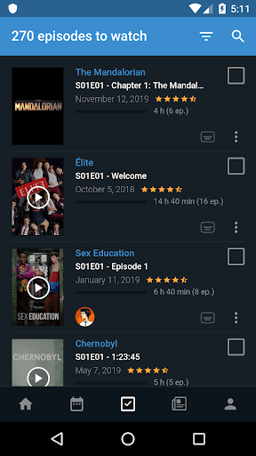
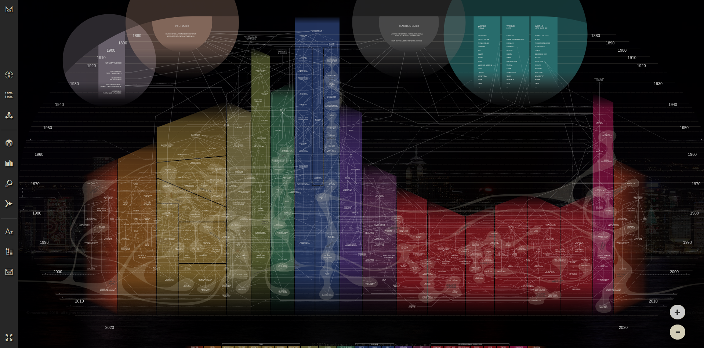
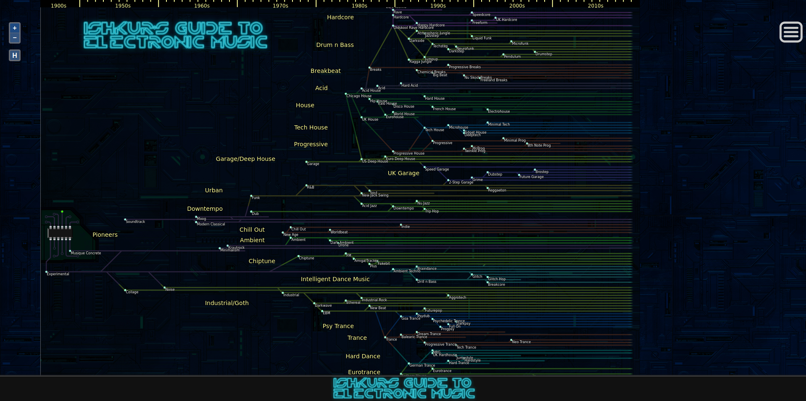
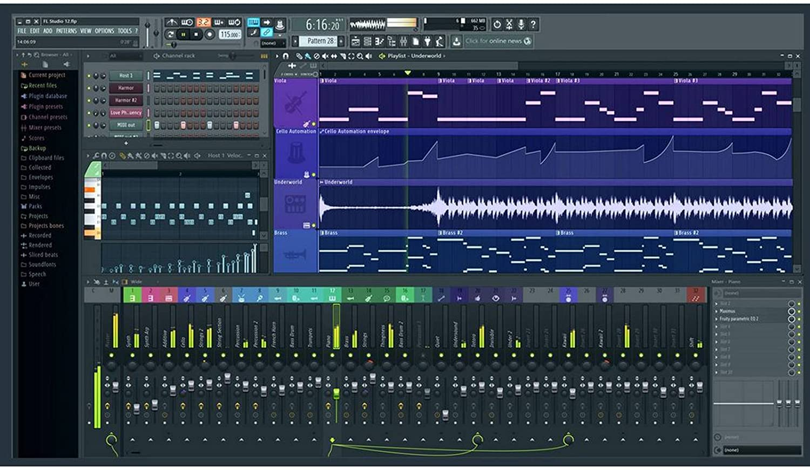
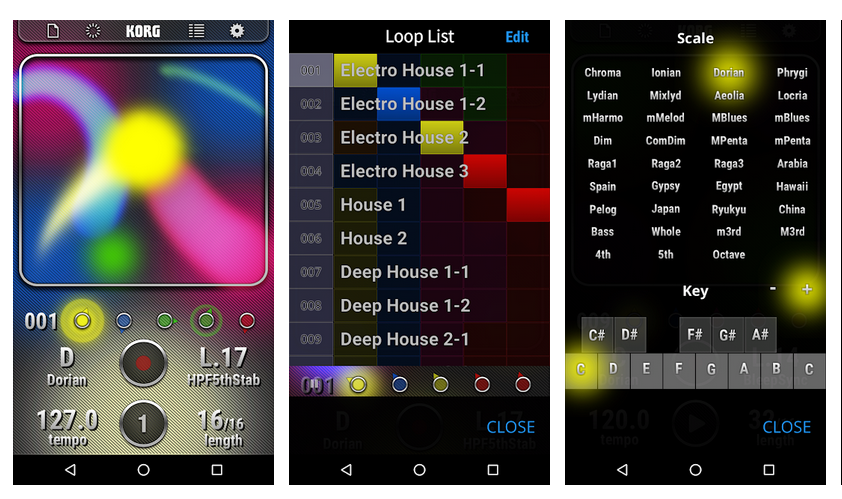

# The boredom annihilation list

_Last update : 23/03/2020, 9:45 EST_

## Usage

Everyone is free to contribute! Feel free to send requests or even better : PRs if you're on GitHub!  
Please make sure to read [how-to](CONTRIBUTING.md) first.

The more contributions there are, the less bored we are.

## Quick word
Confinement is hard. For everyone. We're separated, we have to adapt, 
sometimes stay in tiny spaces and keep our mind busy.

But there's hope! We have the glorious Internet and its contributors.

Let's see all the non-ordinary things we can do with just a laptop and an Internet connexion...

* [Together](#together)
    * [Communication tools](#communication-tools)
        * [text](#text)
        * [voice](#voice)
        * [video](#video)
    * [Watch together](#watch-together)
    * [Games](#games)
        * [console](#consoles-could-be-paying)
        * [boardgames](#boardgames)
* [On your own](#on-your-own)
    * [Social networks](#social-networks)
        * [forums](#forums)
        * [fun](#fun)
    * [Movies](#movies)
        * [platforms](#movie-platforms-paying)
        * [sources of inspiration](#sources-of-inspiration)
    * [Music](#music)
        * [platforms](#music-platforms-paying)
        * [music maps](#music-genealogy)
        * [creation](#create-some-music)
            * [software](#software)
            * [online](#online)
    * [Lean](#learn)
        * [Talks/Podcast](#talkspodcasts)
        * [Cooking](#cooking)
        * [Programming](#programming)
            * [Raspberry](#raspberry)
            * [useful links](#useful-links)
    * [Exercise](#exercise)
    * [(Extended) Reading](#extended-reading)

## Together

### Communication tools

Write. Talk. See each other. We need it !

#### Text

* Telegram

#### Voice

* [Discord](https://discordapp.com/)

Initially created for gamers to communicate while gaming, it's a very cool tool to use.

Each person can create its own server (meaning "virtual space") where it can invite friends, or join other's server.

#### Video

_The commons_
* Messenger
* WhatsApp
* Snapchat
* Viber
* WeChat
* Skype

_The meetings_
* [Jitsi](https://jitsi.org)
* [Zoom](https://zoom.us)

_The new one_
* [HouseParty](https://www.houseparty.com/)

Fun to use because it comes with games such as Draw.  
One inconvenience : the Chrome extension is bursting your CPU...

### Watch together

* [Netflix Party](https://www.netflixparty.com/)

Netflix Party is a new way to watch Netflix with your friends online. 
Netflix Party synchronizes video playback and adds group chat to your favorite Netflix shows. 

### Games

#### Consoles (could be paying)

Business as usual. Carry on.

It's worth mentioning [Steam](https://store.steampowered.com) also offers free to play games (or at very cheap price).

#### Boardgames

* Cards against Humanity alike games (FR)
    * [Limite limite](https://limitelimiteenligne.com) (max 5)
    * [Blanc-manger Coco](https://simmer.io/@Blancmangercoco/blanc-manger-coco)

## On your own

### Social networks

#### Forums
* [Reddit](https://www.reddit.com/)

One of the biggest (if not the biggest) network of communities. News, tips, debates, fun, viral or crap... 
Good or bad, it's fascinating and it's the face of Internet.

You won't have time to explore all subreddits in a single life. Go and subscribe!

#### Fun
* [9gag](https://9gag.com/)

Meme, GIFs and videos. 100% sure it breaks rule #1 but it does with fun.

* [Imgur](https://imgur.com)

9gag brother.

* [Tumblr](https://www.tumblr.com)

The eldest of the family, was popular first.

### Movies

#### Movie platforms (paying)
* [Netflix](https://www.netflix.com/)
* [HBO](https://www.hbo.com/)
* [Crave](https://www.crave.ca) (HBO in Canada)
* [Disney+](https://www.disneyplus.com)
* [Amazon Prime Video](https://www.primevideo.com/)

*and this ethically questionable list...*
* Popcorn Time
* Stremio

#### Sources of inspiration

* the platforms catalog/suggestions

* [Betaseries](https://www.betaseries.com/)

A calendar for your TV shows.

### Music

#### Music platforms (paying)
* [Spotify](https://www.spotify.com)
* [Apple Music](https://www.apple.com/apple-music)
* [Google Play Music](https://play.google.com/music)
* [SoundCloud](https://soundcloud.com)
* [BandCamp](https://bandcamp.com)
* [Deezer](https://www.deezer.com/) (FR)

#### Music genealogy

* [Musicmap](https://musicmap.info)

One of the most splendid music map ever done. Simple, detailed and captivating at the same time.
Some Youtube curated playlists are also available to describe the genres. 

Explore the map and let yourself travel through time.

* [Ishkur](https://music.ishkur.com)

An other genealogy map, but only for electronic music.

Describes with more humour how humans end up creating these genres, while playing curated tracks. 

#### Create some music

##### Software

* [FL Studio](https://www.image-line.com/flstudio/) (free demo)

FL Studio is a digital audio workstation featuring a graphical user interface based on a pattern-based music sequencer.

* [Mini Moog (iOS)](https://apps.apple.com/us/app/minimoog-model-d/id1339418001)

With the latest news, Moog graciously decided to give its app for free.

The Minimoog Model D App is a mobile transmutation of the world’s first portable synthesizer, the Minimoog Model D®.
Optimized for use on all 64-bit iOS devices, anyone can jump in and play with over 160 included presets or lay fingers to the controls 
and begin exploring vast magical realms of creative potential.

* [Korg (Android)](https://play.google.com/store/apps/details?id=jp.co.korg.kaossilator.android)

Same than Moog, Korg temporarily gives this app for free.

"KORG Kaossilator for Android" is a synthesizer app that lets anyone enjoy full-fledged instrumental performance simply by freely moving their finger across the touch panel. 
From electronic sounds to acoustic instruments and drums, you can play a wide range of sounds with a single finger. Also provided is a sequencer that's indispensable for creating songs, 
so you can create tracks by recording and layering your performances. This easy yet full-fledged instrumental experience is now available on your Android smartphone.

##### Online

* Electronic

    * [Zupiter](https://z.musictools.live/)

Zupiter is a synthesizer and step-sequencer that runs in a browser, meaning you don't even need to download and install any software to use it. 
Its interface is designed to be minimalistic and simple, so as not to put off beginners. 

The sharing feature gives you the ability to instantly put your work online.

### Learn

#### Talks/Podcasts

Radio podcasts could have been great but they might be only talking about one thing...

* General
    * [TED](https://www.ted.com)

* Europe
    * [EuroPod](https://www.bullemedia.eu/europod)
    
EuroPod is a network of European podcast shows which brings together journalistic, cultural and institutional views on political and societal trends in Europe and beyond.

### Cooking

Now might be the time to improve your skills...

* [Marmiton](https://www.marmiton.org/) (FR)

Very complete website for cooking with an active community, giving tips and posting recipes.

* [Reddit /r/recipes](https://www.reddit.com/r/recipes/)

Reddit community for recipes. Easy ideas to do at home.

#### Programming

If you're into programming, you might already know a lot about the web and its treasures. 
You might also have plenty of occupations right now...   
Nevertheless, here's a short list of very interesting stuff.

##### Raspberry

Projects examples are not rare, using this tiny computer. ~35$ and you're good to go for an adventure!

* [Retropie](https://retropie.org.uk/)

RetroPie allows you to turn your Raspberry Pi, ODroid C1/C2, or PC into a retro-gaming machine.

You want to bring nostalgia and be granted the occasion to play some Atari, Dreadcast or even N64 games once again? Here is the solution

* [Pi-hole](https://pi-hole.net/)

A black hole for Internet advertisements, literally.

Expect some frustration with Facebook or Messenger when using it...

##### Useful links
* [https://github.com/sindresorhus/awesome](https://github.com/sindresorhus/awesome)
* [https://github.com/sdmg15/Best-websites-a-programmer-should-visit](https://github.com/sdmg15/Best-websites-a-programmer-should-visit)
* [https://github.com/dwmkerr/hacker-laws/](https://github.com/dwmkerr/hacker-laws/)

### Exercise

Yep, it's possible. Many websites describe how to exercise safely at home using only our body, chairs and tables. 

(Links needed)

### (Extended) Reading

The legend tells about an antique technology capable of plugging ourselves in a deep virtual reality
by only seeing obscure shapes on paper, so powerful it could alter our dreams and even our conscience... 
